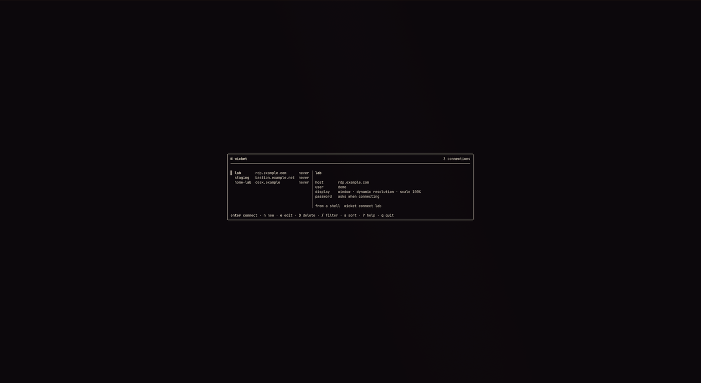
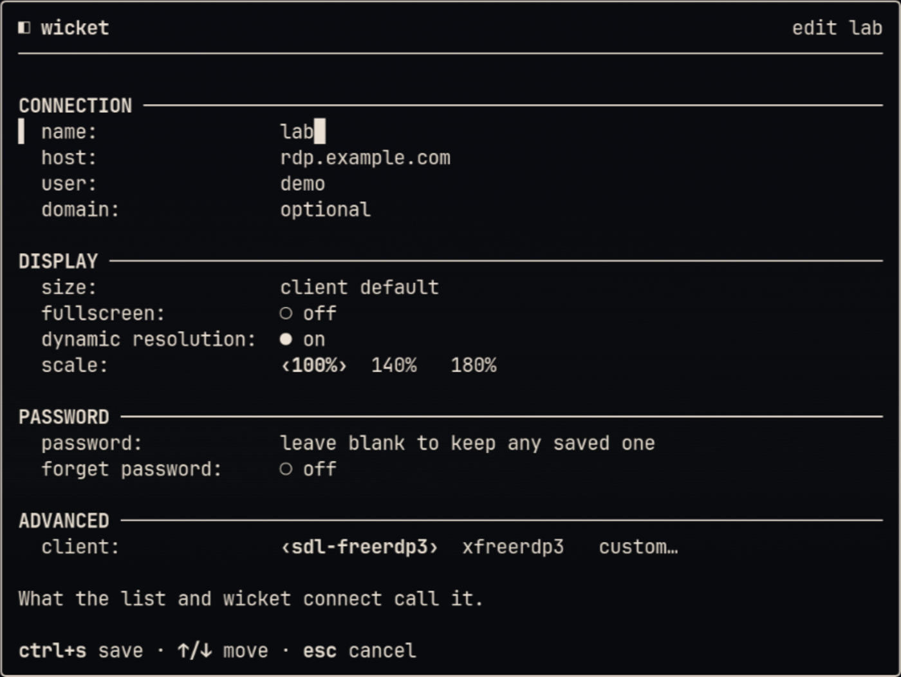
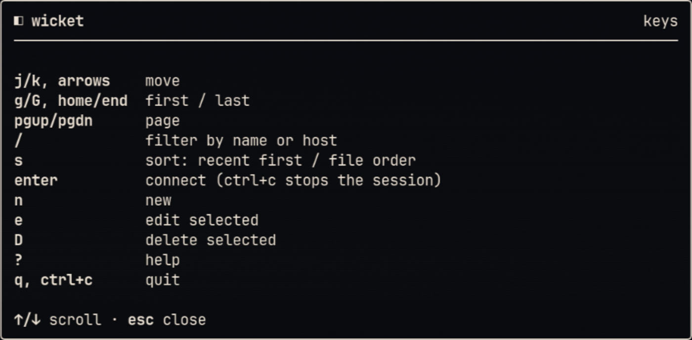

# Wicket

Terminal UI for saved FreeRDP connections. Pick a profile, connect, come back
when the session ends.



<p>
  
  
</p>

## Platform

Linux. Passwords go in the Secret Service keyring (`org.freedesktop.secrets`).
MacOS coming soon; Windows does not build.

## Install

```
curl -fsSL https://raw.githubusercontent.com/gaius-codius/wicket/main/install.sh | sh
```

This installs the latest release for amd64 or arm64 into `~/.local/bin` (set
`WICKET_BINDIR` to change it) after checking it against the release's
`SHA256SUMS`. Run the same command again to update.

```
... | sh -s -- --version v0.1.0   # a given release
... | sh -s -- --uninstall        # remove the binary
```

Config, state, and keyring entries are never touched. Or, with Go:

```
go install github.com/gaius-codius/wicket/cmd/wicket@latest
```

Needs a FreeRDP 3 client on `PATH`: `sdl-freerdp3` or `xfreerdp3`. New profiles
use the first one found, in that order.

## Run

```
wicket                 # TUI
wicket connect work    # named profile, no TUI
wicket --help
wicket --version
```

`wicket connect` is for keybindings and scripts. It does not create a config.
On a non-TTY there is no password prompt, so save the password from the TUI
first. Press `?` in the TUI for keys and field help.

## Config

| | |
|-|-|
| Config | `WICKET_CONFIG`, else `$XDG_CONFIG_HOME/wicket/config.toml`, else `~/.config/wicket/config.toml` |
| State | `WICKET_STATE`, else `$XDG_STATE_HOME/wicket/state.toml`, else `~/.local/state/wicket/state.toml` |
| Theme | `WICKET_THEME`, else `[ui] theme` in config, else `auto` |

Passwords live in libsecret, never in TOML. Hand-editing `config.toml` is
fine; unknown keys are kept. A save from the TUI rewrites the file, so
comments and formatting are lost. Keys named `password`, `pass`, `secret`, or
`passwd` are stripped on save.

Sharing is per profile, set in the form or by hand:

```toml
[[profiles]]
name = "work"
host = "192.168.1.20"
user = "jdoe"
clipboard = false   # on unless turned off, as in FreeRDP
multimon = true     # full screen across every monitor
share_home = true   # your home folder as a drive on the remote machine
```

Keys left out keep their default, and a save only writes the ones changed.

## Theme

```toml
[ui]
theme = "auto"
```

`WICKET_THEME` overrides config for one run.

| Value | Meaning |
|-------|---------|
| `auto` | Omarchy if `~/.local/state/omarchy/current/theme/colors.toml` exists and is readable, else Verdigris |
| `wicket` | Verdigris, matched to the terminal |
| `wicket-dark`, `wicket-light` | Fixed Verdigris variant |
| `omarchy` | Omarchy (terminal colours + warning if missing or unreadable) |
| `terminal` | Terminal ANSI colours |

## Keys

| Key | Action |
|-----|--------|
| `j` / `k`, arrows | Move |
| `g` / `G`, Home / End | First / last |
| PgUp / PgDn | Page |
| `/` | Filter (Esc clears) |
| `s` | Sort by recent use (not saved) |
| `Enter` | Connect |
| `n` / `e` / `D` | New / edit / delete |
| `?` | Help |
| `q`, Ctrl+C | Quit |

Form: Ctrl+S saves, Esc cancels. ←/→ picks the scale and the client
(`custom…` takes any binary name). Leave the password field empty to keep the
stored one; use `forget password` when editing to clear it.

## Sessions

`Enter` starts FreeRDP in its own window; Wicket stays on the status view
until that window closes, then cleans up the process group. During a session,
`Ctrl+C` stops FreeRDP (interrupt, then terminate, then kill). If FreeRDP
fails, or the session ends within a few seconds, you get the reason and can
retry or enter a new password. A logoff or disconnect goes back to the list.

## Contributing

See [CONTRIBUTING.md](CONTRIBUTING.md). Security:
[advisories](https://github.com/gaius-codius/wicket/security/advisories/new)
and [SECURITY.md](SECURITY.md).

CI runs `gofmt`, `go vet`, `go test ./...`, and `go test -race ./internal/secret`
on pushes and pull requests to `main`.

## License

MIT. See [LICENSE](LICENSE).
